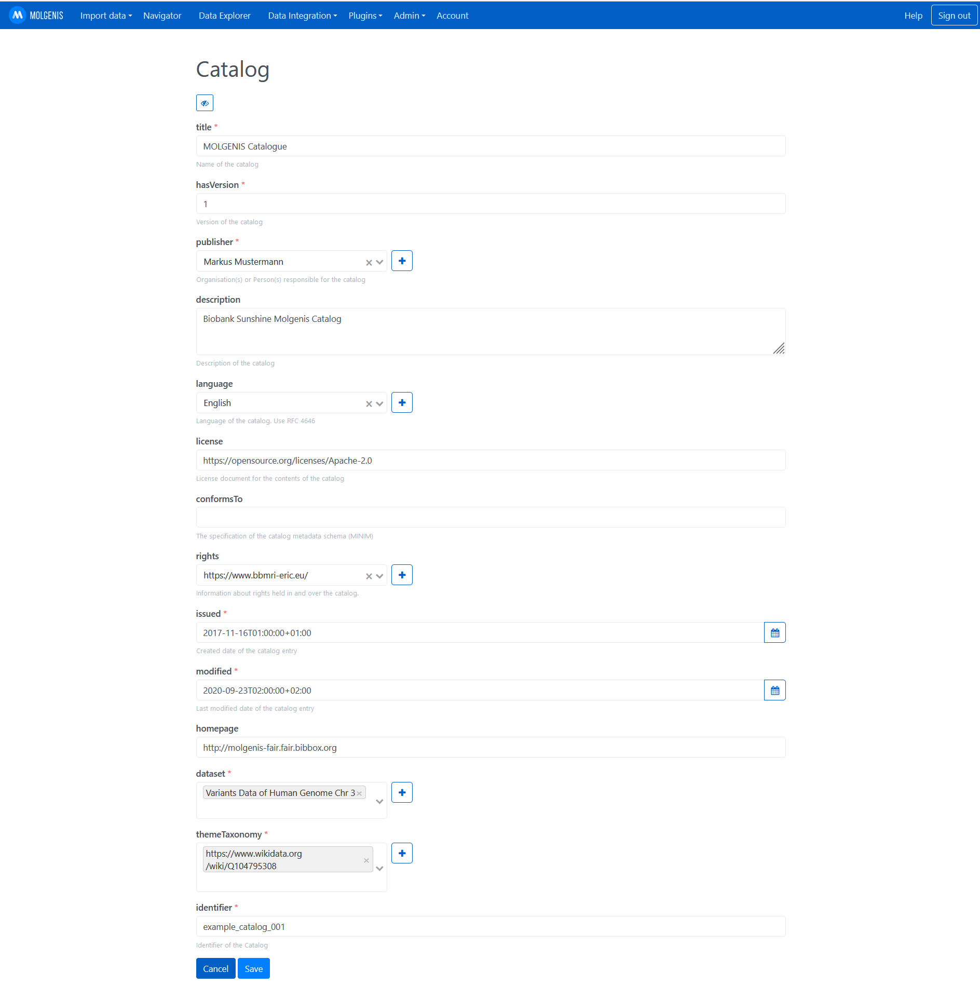

## Molgenis & FAIR Data Point Installation Instructions 

### Start Molgenis

Be patient this can take up to 5 minutes (its a huge app). The last message in the log should be something like this

`17-Sep-2021 07:24:16.134 INFO [main] org.apache.catalina.startup.HostConfig.deployDirectory Deploying web application directory [/usr/local/tomcat/webapps/ROOT]`

### Log in with the default credentials 
Click on "Sign in" on the top right corner of the screen.
The default admin user name is "admin" and the default admin password is "admin".

### Make all further configuration steps within the Molgenis app.
Further information can be found here https://molgenis.org/ and https://molgenis.gitbook.io/molgenis/.

#### Add and manage user permissions in the Admin/User Manager Menu.

#### Upload data (template in /data/molgenis_fdp_template) using the Molgenis EMX format and the "advanced data import" option.
Other fromats like `.csv` and `.vcf` are also supported and can be nativly uploaded.

#### Navigate through your data using the Navigator.

#### FAIRification
Follow these steps to make the app FAIR (**F**indable, **A**ccessible, **I**nteroperable and **R**eusable).

1) upload the FDP template (FDP_template_EMX1.xlsx) to Molgenis. It can be found under data/molgenis_fdp_template
2) Using the Navigator, you will find a new package (fdp). Click on it.
3) Add the information to the Catalog, Dataset and Distribution tables, according to your uploaded data you wish to be represented in the FAIR data point. Find an example for a catalog entry below. 

#### Set up FAIR Data Point.

Open Jupyter via the app dashboard or by changing the subdomain of the url to `<instancename>-jupyter`:

1) Open jupyter notebook (/work/fillFDP.ipynb) 
    
2) set User credentials for the FAIR Data Point and Molgenis
FDP default credentials: EMail "albert.einstein@example.com", Password: "password"

3) creates FDP data from imported molgenis data points (added to molgenis by uploading) by executing the jupyter notebook by clicking the fast forward symbol (&#9193;) on the top

#### Login at the FAIR Data Point
On the APP dashboard click on teh FDP : "FDPJupyter"
The default username is "albert.einstein@example.com" and password is set to "password".
#### Change default password
After logging in, change the password (top right corner: "edit profile")

## After the installation
Have a nice ride with the Admins youngtimer.

